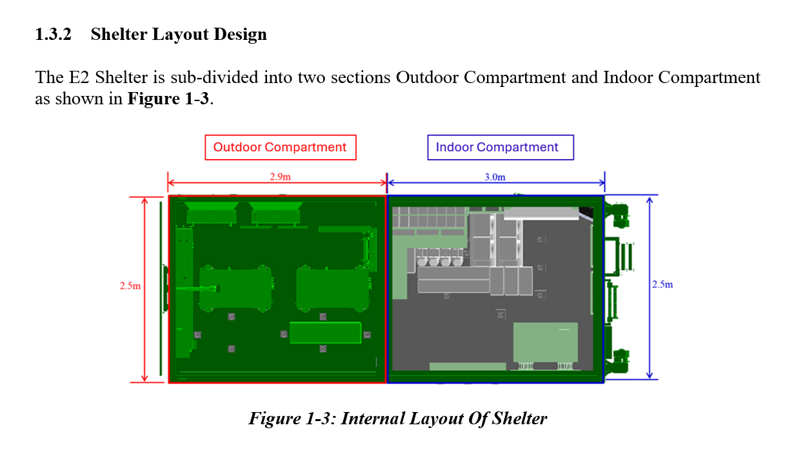
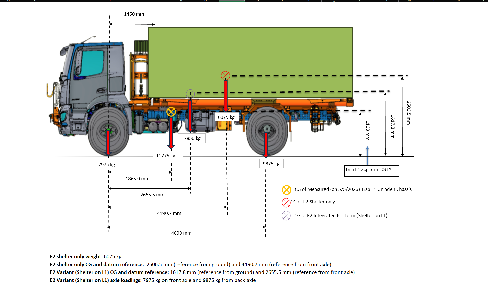
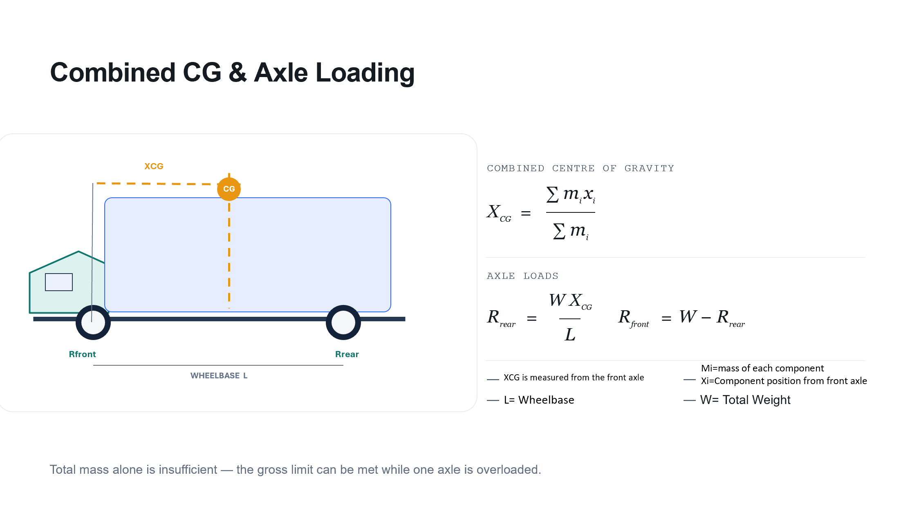
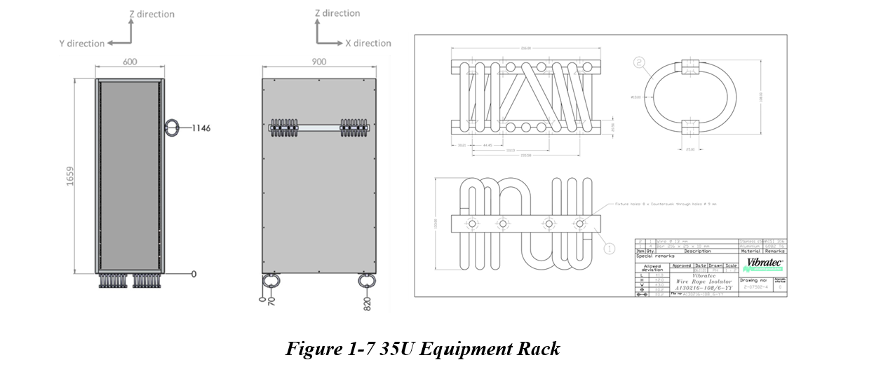
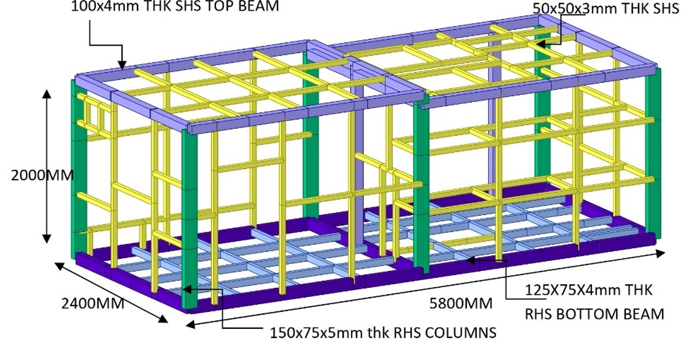
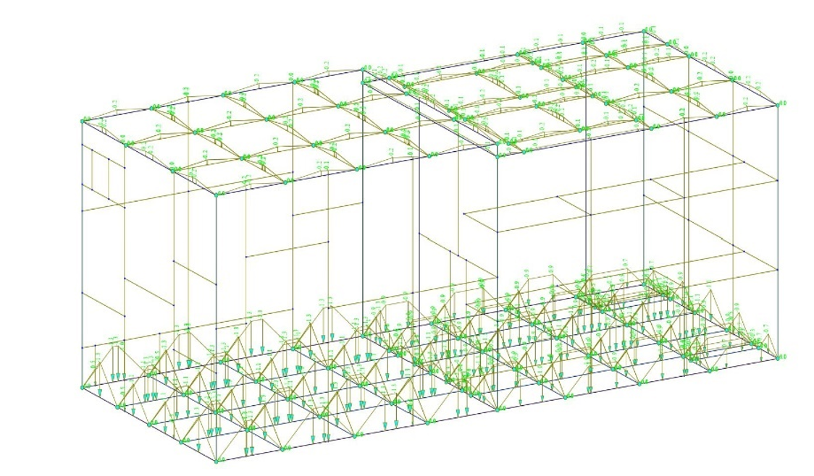
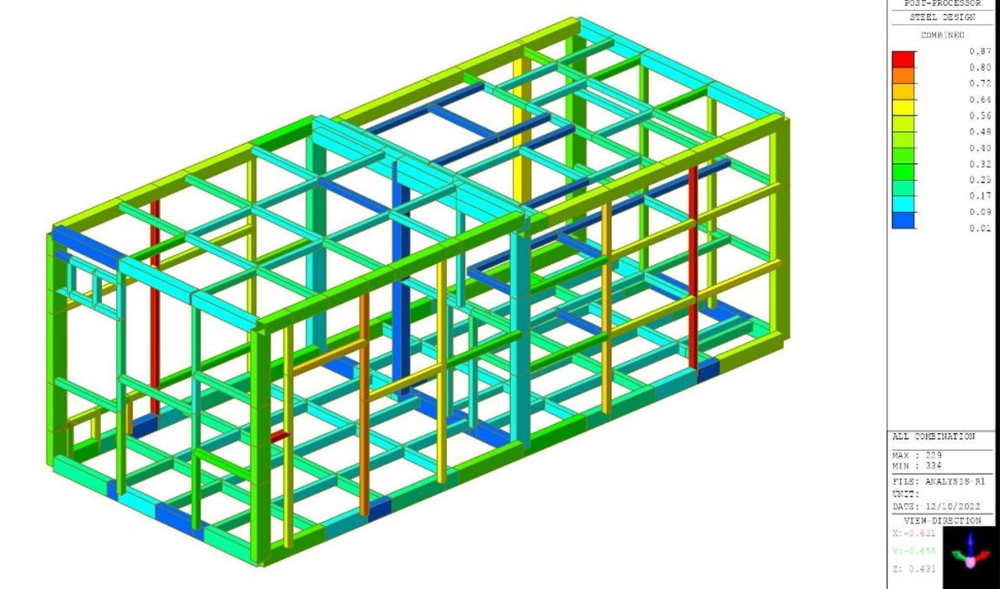
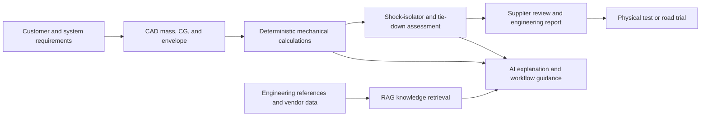
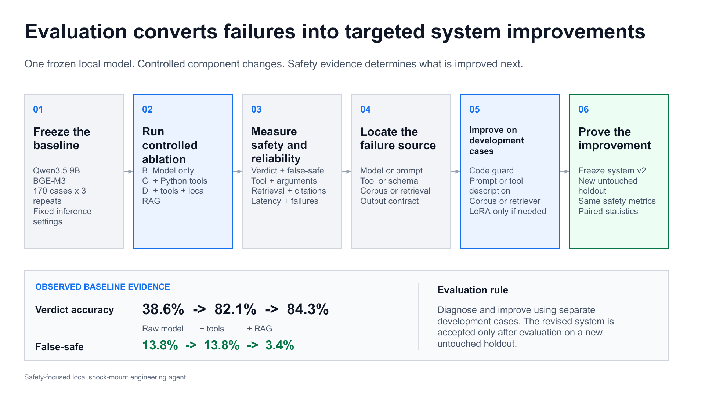
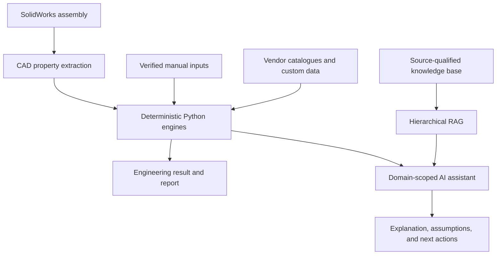

# CAD-Aware Mechanical Engineering Assistant

A mechanical-engineering web application for the preliminary design and
verification of vehicle-mounted equipment shelters. The application combines
SolidWorks property extraction, deterministic engineering calculations,
vendor-aware shock-isolator screening, and an AI assistant that explains
results without replacing the underlying physics.

The project was developed around a practical vehicle-integration workflow:

1. establish the equipment mass, centre of gravity, mounting arrangement, and
   operating requirements;
2. assess vehicle stability and structural tie-down loads;
3. select and verify wire-rope shock isolators;
4. prepare traceable engineering outputs for design review and supplier
   follow-up; and
5. retain physical testing and final approval as separate qualification steps.

> [!IMPORTANT]
> This application is a preliminary engineering and decision-support tool. It
> does not certify a vehicle installation, replace detailed FEA, or replace
> supplier and physical-test evidence.

## Mechanical Engineering Portfolio

**Mechanical Engineering Intern | ST Engineering, Singapore | May - August 2026**

This application grew out of practical mechanical design and assessment work,
not just a software demonstration. My internship contributions included:

- **Shelter design and equipment integration:** developed SolidWorks CAD models
  and internal equipment layouts, using centre-of-gravity and stability
  calculations to assess equipment placement and rollover margins.
- **Structural verification:** performed SolidWorks Simulation FEA on shelter
  tie-down components, assessing stress against material strength limits and
  reviewing displacement and fastener loading under directional inertial loads.
- **Engineering workflow automation:** developed this application to bring CAD
  properties, spreadsheet calculations, technical documents and vendor
  catalogues into a repeatable calculation and component-selection workflow.

The examples below show the mechanical problems behind the software. Project
and supplier reference figures are identified separately from my own analysis
activities; they are not all outputs generated by this application.

### Shelter Layout and Equipment Integration



*Project layout example: equipment integration within a vehicle-mounted shelter.*

Layout work connects packaging constraints to mechanical performance: equipment
position affects access, mounting interfaces, total mass and the shelter's CG.
The resulting mass properties become inputs to the vehicle stability and
axle-loading assessment.

### Centre of Gravity and Axle Loading



*Worked vehicle-integration assessment showing the chassis, shelter and combined
CG, with front- and rear-axle loading. Source measurements and project inputs
are shown in the figure; they are not measurements made by the application.*

The engineering task is to combine masses and their positions using a common
datum, then use moment equilibrium to calculate axle reactions. Meeting a gross
vehicle mass limit alone does not demonstrate acceptable axle loading. CG height
and lateral offset also inform slope and overturning assessments.

<details>
<summary>Calculation method: combined CG and axle reactions</summary>



*Method illustration for a level-ground, two-support vehicle model. Positions
are measured from the front axle; W denotes weight, so reactions are forces.*

</details>

### Rack Mounting and Shock-Isolator Selection



*Project rack arrangement with a supplier reference drawing. The Vibratec
isolator drawing is vendor geometry, not an original isolator design.*

Selection work considers equipment mass, mounting orientation, directional
stiffness, transmitted acceleration and available movement clearance. The rack
and its mounting interfaces must accommodate the selected isolator's motion;
catalogue selection alone does not verify the complete installation.

### FEA and Structural-Assessment Context

My SolidWorks Simulation work assessed tie-down components under longitudinal,
transverse and vertical inertial loads. This is separate from the application's
analytical fastener and tie-down calculations: the web application does not run
a SolidWorks FEA solver.

The following shelter-frame figures provide **reference structural-analysis
context**, not screenshots of my 2026 tie-down FEA. The supplied result image is
dated 2022; it must not be attributed to this internship or used as proof of a
new analysis.

<details>
<summary>Reference figures: frame geometry, analysis model and steel-design output</summary>



*Reference frame geometry showing the structural members and overall envelope.*



*Reference structural model showing member idealisation and analysis setup.
Software, load-case definitions and boundary conditions cannot be established
from this screenshot alone.*



*Reference output labelled "STEEL DESIGN / COMBINED". The colour scale is not
identified as stress in MPa and is not presented here as a stress contour or a
verified factor of safety. Interpretation requires the original report and its
design-check definitions.*

</details>

**From mechanical work to software:** CAD establishes the geometry and mass
properties; calculations screen loads and candidate components; FEA assesses
structural response; supplier evidence and physical testing support final
qualification. This repository automates the repeatable calculation and
documentation steps, while keeping those responsibilities distinct.

## Engineering Scope

The mechanical work supporting this project includes:

- SolidWorks CAD development for vehicle-mounted equipment shelters, racks,
  interfaces, and tie-down provisions;
- centre-of-gravity, axle-load, wheel-load, slope-stability, and rollover
  calculations;
- SolidWorks Simulation FEA of tie-down structures under longitudinal,
  transverse, and vertical inertial load cases;
- wire-rope shock-isolator selection using static load, directional stiffness,
  natural frequency, transmitted acceleration, displacement, and clearance;
- comparison of published data from VMC, Vibratec, and Socitec;
- supplier technical enquiries covering shock, vibration, installation,
  environment, and service-life requirements; and
- road-trial and functional-acceptance planning, including input-side and
  rack-side accelerometer measurements.

The FEA remains a separate engineering activity. This repository automates the
repeatable calculations and evidence workflow that support CAD, FEA, supplier
review, and testing.

## Application Workflow



The calculation engines, rather than the language model, own unit conversion,
equations, limits, candidate selection, and PASS/FAIL decisions. The AI layer
selects the appropriate tool, retrieves supporting evidence, and explains the
result and its assumptions.

## Core Capabilities

### 1. Shock-Isolator Selection

The shock engine evaluates four directional load cases:

- compression at the bottom mounts;
- compression at the wall stabilisers;
- shear/roll at the wall stabilisers; and
- roll at the bottom mounts.

For each case, it calculates:

```text
Velocity change:       V  = pulse coefficient * g * Ao * to
Natural frequency:     fn = (1 / 2*pi) * sqrt(K / m)
Transmitted shock:     GT = 2*pi*fn*V / g
Dynamic displacement: dD = V / (2*pi*fn)
```

The selector checks transmitted acceleration, rated dynamic travel, available
installation clearance, static load capacity, and the validity of the
short-pulse approximation. It can automatically select from the VMC CB61400,
CB1400, CB1500, and CB1700 families or verify a user-specified part.

The custom-vendor workflow supports three published data formats:

| Vendor-data format | Engineering treatment |
|---|---|
| Published directional shock stiffness | Used directly after unit validation |
| Rated load at natural frequency | Equivalent stiffness derived for screening |
| Shock force at corresponding deflection | Secant stiffness derived for screening |

Derived values remain labelled as `screening_only`; they are not presented as
equivalent to published shock stiffness.

### 2. SolidWorks CAD Import

On Windows, the application can connect to SolidWorks through the COM API and
extract:

- assembly mass;
- centre of gravity in X, Y, and Z; and
- bounding-box dimensions.

These properties can be passed directly into the shock workflow. The CAD import
is optional: every calculator can also be used with manually verified inputs.
SolidWorks COM extraction is unavailable on Linux and Streamlit Community
Cloud.

### 3. Tie-Down Verification

The tie-down module converts longitudinal, transverse, and vertical design
accelerations into equipment and fastener loads. It evaluates:

- mounting-face-dependent tension and shear;
- directional fastener demand;
- fastener strength and effective area;
- safety factor; and
- minimum fastener quantity or size for a target safety factor.

The workflow also generates an Appendix G-style engineering report for design
review.

### 4. Mobility and Stability

The mobility workspace evaluates:

- combined centre of gravity using mass moments;
- front/rear axle and individual wheel loads;
- longitudinal and side-slope stability;
- critical rollover angles and stability factors;
- cornering response;
- tilt-test-based vertical CG estimation; and
- ISO twist-lock strength checks.

Results can be exported into Safety Assessment Report-style appendices.

### 5. Supplier and Test Evidence

The application can generate a structured supplier enquiry pack containing:

- equipment mass and centre of gravity;
- mount quantity, orientation, and interface requirements;
- shock and random-vibration requirements;
- operating state and equipment fragility limits;
- environmental and corrosion requirements;
- installation clearance and snubbing requirements; and
- supplier-response and road-trial records.

Evidence is separated into deterministic screening, supplier simulation,
laboratory testing, and functional road-trial status. A supplier calculation is
not automatically described as a physical test or qualification.

## Mechanical Validation

### Shock Reference Case

The four-case shock engine reproduces a hand-validated engineering workbook for
the reference configuration:

| Input or output | Reference value |
|---|---:|
| Supported mass | 850 kg |
| Base / wall mounts | 6 / 4 |
| Input shock | 20 G, 11 ms |
| Equipment limit | 10 G |
| Selected reference part | CB1400-15 |
| Transmitted acceleration | 6.296 G |
| Dynamic displacement | 18.85 mm |

The Python result matches the workbook calculation to four decimal places.

### Tie-Down Validation

The tie-down engine was compared with the reference workbook across 59
equipment items and 177 directional safety-factor results. All 177 values were
reproduced, with a reported maximum numerical difference of approximately
`9e-13`.

### Mobility Validation

The CG, axle-load, wheel-load, slope-stability, and mobility calculations are
covered by workbook-based regression tests, including multi-axle vehicle
scenarios and tilt-test inputs.

## AI Safety Evaluation

The AI assistant was evaluated on a frozen 170-case shock-mount benchmark with
three repeats per system. The same local model was tested alone, with
deterministic tools, and with deterministic tools plus RAG.

| System | Verdict accuracy | False-safe rate |
|---|---:|---:|
| LLM only | 38.6% | 13.8% |
| LLM + deterministic tools | 82.1% | 13.8% |
| LLM + tools + RAG | 84.3% | 3.4% |

Adding deterministic engineering tools improved verdict accuracy by 43.6
percentage points (`p < 0.0001`). The RAG-enabled system achieved 86.7% Hit@3
on the frozen reference cases. These results measure agreement with the Python
engineering oracle, not physical safety certification.



Full methodology and results are available in:

- [Final release verification](evaluation/FINAL_RELEASE_VERIFICATION.md)
- [Formal B/C/D evaluation report](evaluation/results/BCD_shock_final_v1_report.md)
- [Evaluation protocol](evaluation/PROTOCOL.md)

## Application Views

| View | Purpose |
|---|---|
| Shock selector | Automatically recommend or manually verify a wire-rope isolator |
| CAD import | Extract mass, CG, and envelope from an active SolidWorks assembly |
| Tie-down | Check equipment and fastener loads and generate an Appendix G-style report |
| Mobility | Evaluate CG, axle/wheel loads, slope stability, cornering, and twist locks |

Each domain includes a scoped assistant. The calculators and report generators
remain usable when the AI provider is disabled.

## Architecture



Key implementation boundaries:

- `physics_engine.py` and `catalog.py`: shock calculations and part selection;
- `custom_isolator.py`: vendor-neutral unit conversion and provenance;
- `tiedown_engine.py`: structural tie-down and fastener checks;
- `mobility_engine.py`: CG, axle loading, and stability calculations;
- `test_assembly.py`: SolidWorks COM extraction;
- `agent.py`: domain tools and assistant orchestration;
- `nvidia_embedder.py`: JSON vector store and retrieval; and
- `app.py`: Streamlit user interface.

## Quick Start

### Prerequisites

- Python 3.10 or later;
- Windows and SolidWorks only if using live CAD import; and
- an optional OpenAI, NVIDIA, or local Ollama model for the assistants.

### Installation

```bash
git clone https://github.com/qujianyang/CAD-Agent-MPD.git
cd CAD-Agent-MPD
python -m venv .venv
```

Windows PowerShell:

```powershell
.\.venv\Scripts\Activate.ps1
python -m pip install --upgrade pip
python -m pip install -r requirements.txt
python -m streamlit run app.py
```

macOS or Linux, without SolidWorks CAD import:

```bash
source .venv/bin/activate
python -m pip install --upgrade pip
python -m pip install -r requirements.txt
python -m streamlit run app.py
```

The deterministic calculators work without an LLM API key. To enable an AI
assistant, create a local `.env` file and select one provider.

OpenAI example:

```dotenv
LLM_PROVIDER=openai
OPENAI_API_KEY=replace-with-your-key
OPENAI_MODEL=gpt-5.4-mini
```

NVIDIA example:

```dotenv
LLM_PROVIDER=nvidia
NVIDIA_API_KEY=replace-with-your-key
NVIDIA_MODEL=meta/llama-3.1-70b-instruct
```

Local Ollama example:

```dotenv
LLM_PROVIDER=ollama
OLLAMA_MODEL=qwen3:14b
OLLAMA_BASE_URL=http://localhost:11434/v1
```

Do not commit `.env` or `.streamlit/secrets.toml`.

## Testing

Install the development dependency and run the complete suite:

```bash
python -m pip install -r requirements-dev.txt
python -m pytest -q
```

Focused engineering validation scripts are available under `scripts/` for the
shock, vibration, tie-down, mobility, and twist-lock calculations.

## Repository Structure

```text
CAD-Agent-MPD/
|-- app.py                     # Streamlit application
|-- agent.py                   # Domain-scoped engineering assistants
|-- physics_engine.py          # Shock-isolation calculations
|-- catalog.py                 # VMC wire-rope isolator catalogue
|-- custom_isolator.py         # Vendor-neutral data normalisation
|-- tiedown_engine.py          # Tie-down and fastener calculations
|-- mobility_engine.py         # CG and vehicle-stability calculations
|-- test_assembly.py           # SolidWorks COM extraction
|-- knowledge/                 # Source-qualified RAG knowledge
|-- evaluation/                # Frozen benchmark, scoring, and reports
|-- tests/                     # Automated regression tests
|-- scripts/                   # Workbook validation utilities
`-- docs/                      # Engineering and deployment documentation
```

## Engineering Limitations

- The shock model uses average directional stiffness and single-degree-of-
  freedom load cases. It does not reproduce complete nonlinear wire-rope
  hysteresis, strand contact, friction, preload, fatigue, or permanent set.
- Shock stiffness and vibration stiffness are not interchangeable.
- Stiffness derived from rated load/frequency or force/deflection data is a
  screening approximation unless confirmed by the supplier.
- The rack is treated as rigid in the current shock engine, and CG offset is
  not yet used to redistribute load between individual isolators.
- Catalogue suitability does not prove bracket, fastener, interface, cable,
  connector, or complete-system qualification.
- Final acceptance requires approved engineering review, supplier confirmation,
  and the applicable laboratory test or functional road trial.

## Public-Repository Data Policy

Only sanitised example data should be published. Do not commit customer names,
project identifiers, proprietary workbooks, supplier-confidential reports,
unapproved CAD files, API keys, or physical-test records.

## Author

**Jian Yang Qu**  
Mechanical Engineering undergraduate, Nanyang Technological University

